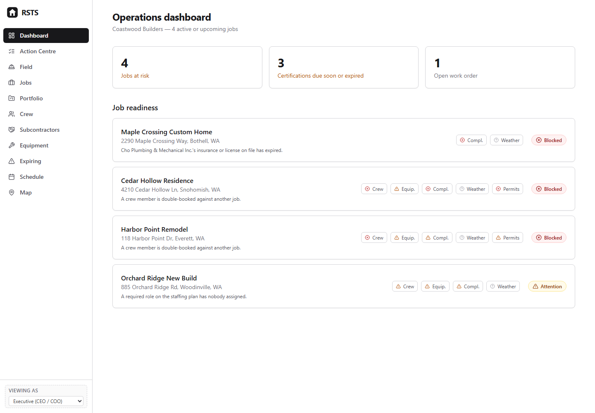
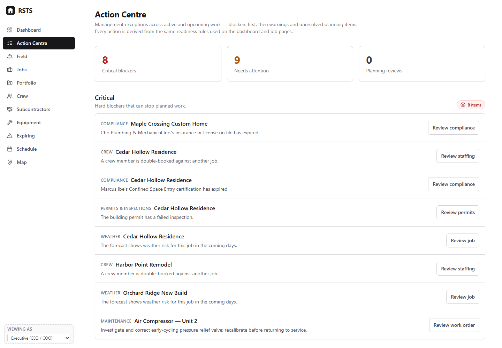
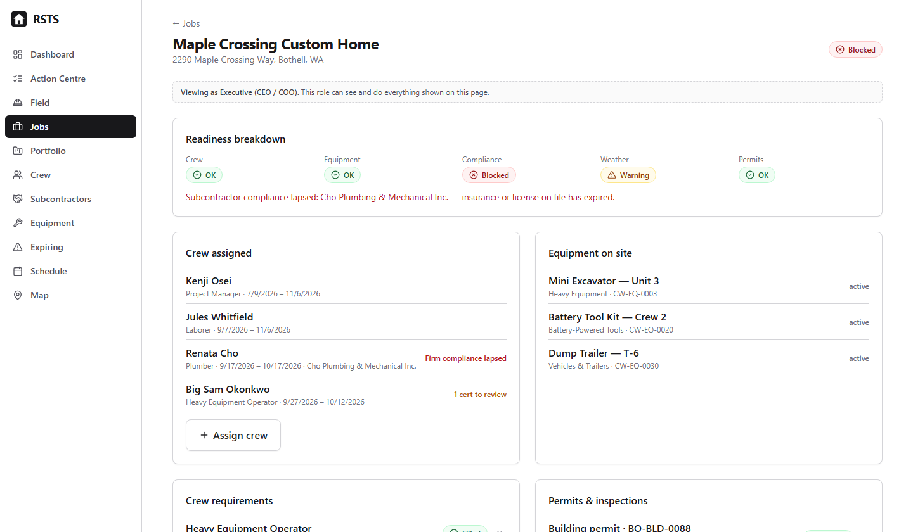

# Resource Scheduling & Tracking System

**Construction field operations, resource readiness and compliance in one decision-support system.**

The system is built around one management question:

> **Can this job run as planned, and what needs intervention before it can?**

[**Open the live demo**](https://resource-scheduling-tracking-system.onrender.com/) · [**3-minute system tour**](docs/DEMO_GUIDE.md) · [**Case study**](docs/PORTFOLIO_CASE_STUDY.md) · [**Architecture**](docs/ARCHITECTURE.md)

> The demo runs on a free host and may take about a minute to wake on first load. Every visitor receives an isolated temporary dataset, so the system can be edited safely.



*Portfolio-level readiness turns crew, equipment, compliance, weather and permit constraints into visible management exceptions.*

## Executive overview

Field operations rarely fail because one spreadsheet is wrong. They fail because crew availability, equipment, credentials, permits, inspections, maintenance and weather are managed in separate places and nobody sees the combined constraint early enough.

This system brings those signals together and converts them into an **explainable job-readiness verdict**. Crew, equipment, compliance, weather and permits are evaluated independently; the overall job state reflects the worst applicable component, with the reason visible to the user.

| Operating question | System control |
| --- | --- |
| Do we have the right people? | Staffing plans, assignments, utilization, certification gates and conflict detection |
| Is the required equipment available? | Reservations, QR custody, overlap detection, defects and maintenance status |
| Are people, firms and assets compliant? | Worker credentials, subcontractor insurance/licensing and equipment compliance |
| Can the work legally proceed? | Permit status, inspection sequencing and failed/expired hard stops |
| What needs management attention? | Action Centre, cross-job expiry view, readiness breakdown and audit activity |
| Can field teams update the system quickly? | Mobile field view, QR scans, daily logs and toolbox talks |

**Coastwood Builders is fictional.** All jobs, workers, subcontractors, certifications and assets in the demonstration data are synthetic.

## What I designed

The project is deliberately more than a scheduling screen. The important design work is in the operating rules behind it:

- **Explainable readiness.** No opaque composite score. Crew, equipment, compliance, weather and permits remain visible as separate management signals.
- **Plan versus fact.** Staffing requirements are distinct from assignments; equipment reservations are distinct from physical custody. The system can therefore expose a plan that is not actually resourced.
- **Hard stops where they belong.** A genuinely expired required credential can prevent an assignment; a failed inspection or expired permit can block a job.
- **Operational conflicts stay visible.** Overlapping assignments and equipment reservations are surfaced rather than silently prevented, because a manager may intentionally create a conflict before resolving it.
- **Compliance reflects the real rule.** Worker credentials support different renewal patterns, and equipment maintenance/compliance supports multiple counters, tolerance windows and hard limits.
- **Defects become work.** A field defect scan takes an asset out of service and opens a work order in the same transaction.
- **Honest weather information.** Near-term forecast data and longer-range climatological context are presented separately rather than manufacturing a deterministic long-range forecast.
- **Traceable decisions.** Material state changes—assignments, reservations, certifications, custody, defects, maintenance completion, permits, inspections, waivers and incidents—feed an operational audit trail.

## Management views



*The Action Centre separates critical blockers from warnings and planning unknowns so intervention starts with the highest-consequence work.*



*Job-level readiness preserves the reason behind the overall verdict instead of hiding it inside a composite score.*


The application includes an **Action Centre** for blockers and interventions, a three-week crew look-ahead, cross-job expiry/compliance review, multi-site map and portfolio roll-up, job-level readiness, equipment and worker records, and a mobile-first field mode.

CSV export is available for core operational datasets. Crew, jobs and equipment also support a validated **preview → duplicate check → explicit confirmation → transaction-backed import** workflow rather than writing unreviewed spreadsheet rows directly into the system.

For a guided walkthrough, use the [3-minute system tour](docs/DEMO_GUIDE.md).

## Engineering and control design

The implementation is **Next.js + TypeScript + React + Prisma + SQLite**. Business rules are separated from UI and persistence under `lib/domain`, while readiness orchestration is split into focused component evaluators.

Quality controls include:

- lint and TypeScript gates;
- domain regression tests;
- database-backed operational workflow integration tests;
- production build verification;
- Playwright UI smoke testing;
- serious/critical accessibility checks;
- database uniqueness constraints and deliberate transaction boundaries;
- stale-write protection on disputed records;
- per-visitor isolated demo databases with bounded connection pooling and cleanup.

The hosted SQLite/session architecture is intentionally optimized for a safe portfolio demonstration. It is **not presented as the production architecture for a multi-user enterprise deployment**. See [Architecture](docs/ARCHITECTURE.md) for the production boundary and evolution path.

## Scope discipline

This is a **field-operations and resource-readiness system**, not a construction ERP.

Estimating, accounting, job costing, RFIs, submittals and broad document management are intentionally excluded. Those are substantial domains in their own right; adding shallow versions would make the operating boundary less credible, not more complete.

The role switcher demonstrates intended UI permission differences only. It is **not authentication or server-side authorization**. A production deployment would require authenticated users, server-enforced RBAC, tenant boundaries, PostgreSQL, committed migration history, backups and observability.

## Repository guide

```text
app/                     Next.js pages and API routes
components/              Shared UI and field workflow components
lib/domain/              Framework-free operating rules
lib/readiness/           Focused readiness component evaluators
lib/__tests__/           CSV and database-backed workflow tests
lib/domain/__tests__/    Domain regression coverage
lib/weather/             Forecast and climatology integrations
prisma/                  Schema and modular synthetic demo seed
docs/                    Architecture, case study and demo guide
```

Start with [Portfolio Case Study](docs/PORTFOLIO_CASE_STUDY.md) for the management problem and product decisions, then [Architecture](docs/ARCHITECTURE.md) for technical design.

## Run locally

```bash
git clone https://github.com/NathanTaylorOps/resource-scheduling-tracking-system.git
cd resource-scheduling-tracking-system
npm install
cp .env.example .env
npx prisma generate
npm run db:build-template
npm run dev
```

Then open `http://localhost:3000`.

Useful checks:

```bash
npm run lint
npm run typecheck
npm run test:domain
npm run test:integration
npm run build
```

## Portfolio context

This project demonstrates how I translate operating failure modes into controls, workflows and management visibility: resource conflicts, readiness gates, compliance exposure, maintenance state, field records and exception management.

Related portfolio projects:

- [BidGate](https://github.com/NathanTaylorOps/bidgate) — bid qualification and decision gating
- [Job Cost Risk Dashboard](https://github.com/NathanTaylorOps/job-cost-risk-dashboard) — job-cost and schedule risk
- [Scenario Sensitivity Engine](https://github.com/NathanTaylorOps/scenario-sensitivity-engine) — management scenario and sensitivity modelling

## License

MIT — see [LICENSE](LICENSE).
